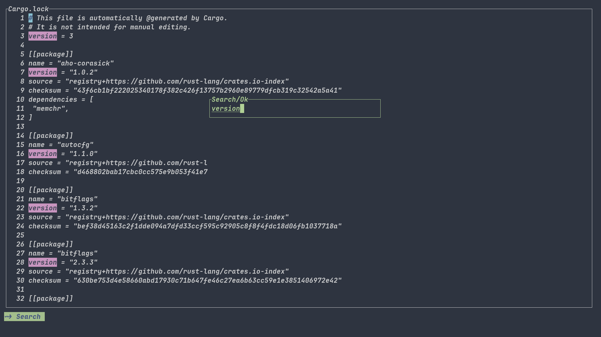

# wi-editor
A personal practice for writing tui text editor with rust.  

Features: 
- vim-like && emacs-like modal eidting support
- lovely and beautiful
- more, work in progress :)

Note:  
Just a toy editor and in progress.  

# Screenshots

